# Introduction to AWS IAM Lab

## Lab Overview
This lab demonstrates how AWS IAM users, groups, and policies work together to control access.

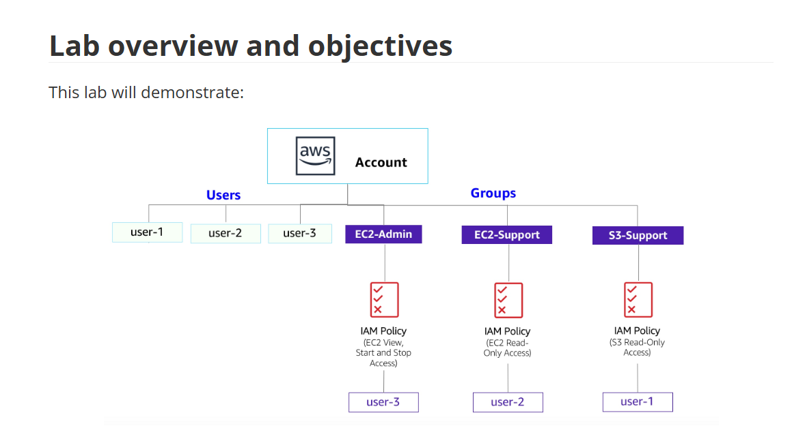

---

## Objectives
- Explore pre-created IAM users and groups  
- Inspect IAM policies applied to groups  
- Add users to groups based on real-world scenarios  
- Locate and use the IAM sign-in URL  
- Test how policies affect access to AWS services  

---

## Task 1: Explore Users and Groups

### Steps
1. Search for **IAM** and open the service  
2. From the left navigation pane, choose **Users**  
3. Select **user-1** from the list  

4. Review the **Summary** page (Permissions, Groups, Security credentials)

5. From the left navigation pane, choose **User groups**

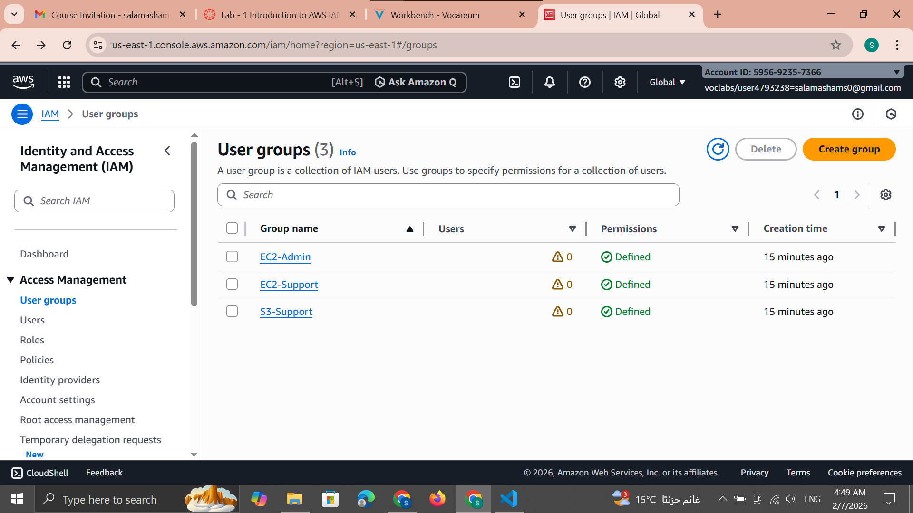

6. Select the **EC2-Support** group  
7. Review **S3-Support** and **EC2-Admin** groups  

**Business Scenario:**

---

## Task 2: Add Users to Groups

### Add user-1 to the S3-Support group
1. Open **User groups**
2. Select **S3-Support**
3. Go to **Users → Add users**

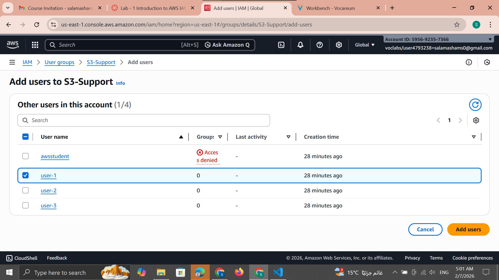

✅ User added successfully:

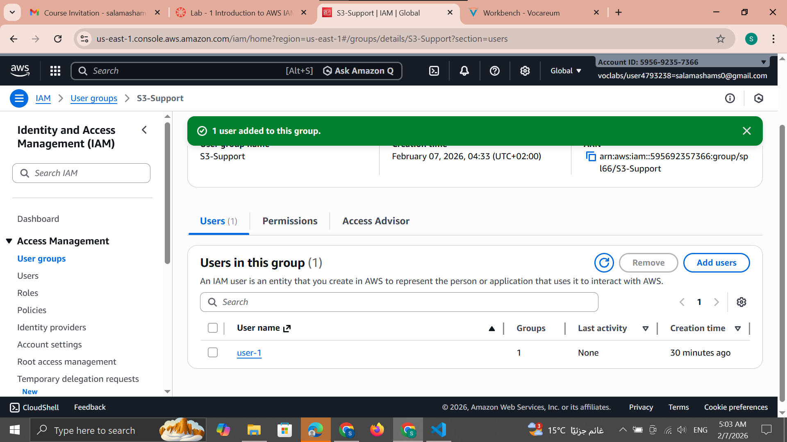

---

### Add user-2 to the EC2-Support group
1. Open **EC2-Support**
2. Add **user-2**

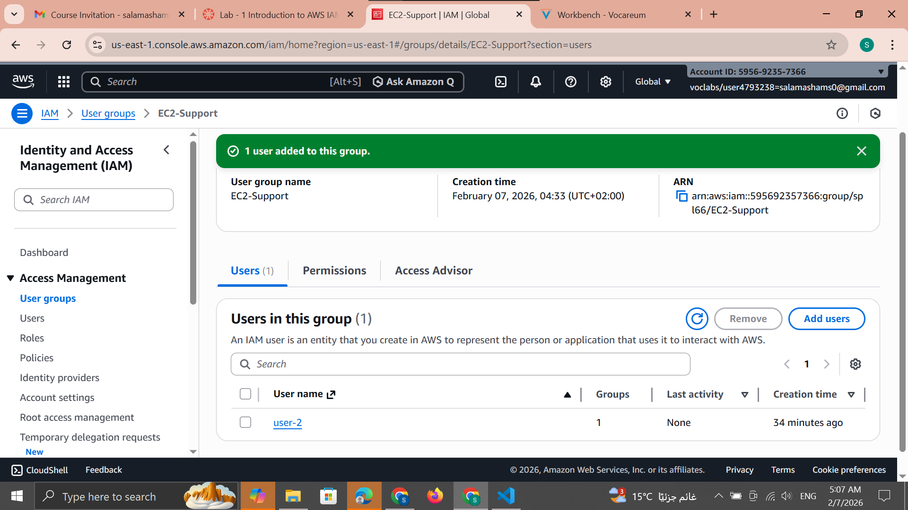

---

### Add user-3 to the EC2-Admin group
1. Open **EC2-Admin**
2. Add **user-3**

All users are now assigned to their respective groups:

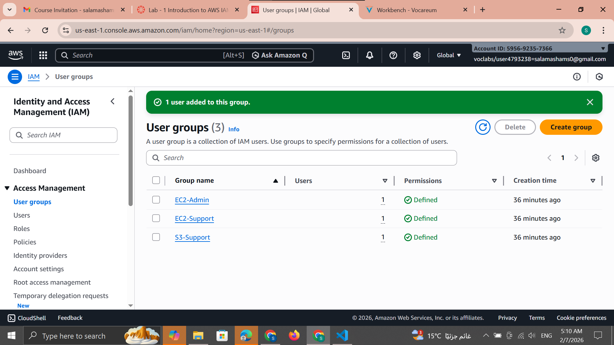

---

## Task 3: Sign In and Test Users

### User 1 Test
1. From the IAM dashboard, copy the **Sign-in URL**

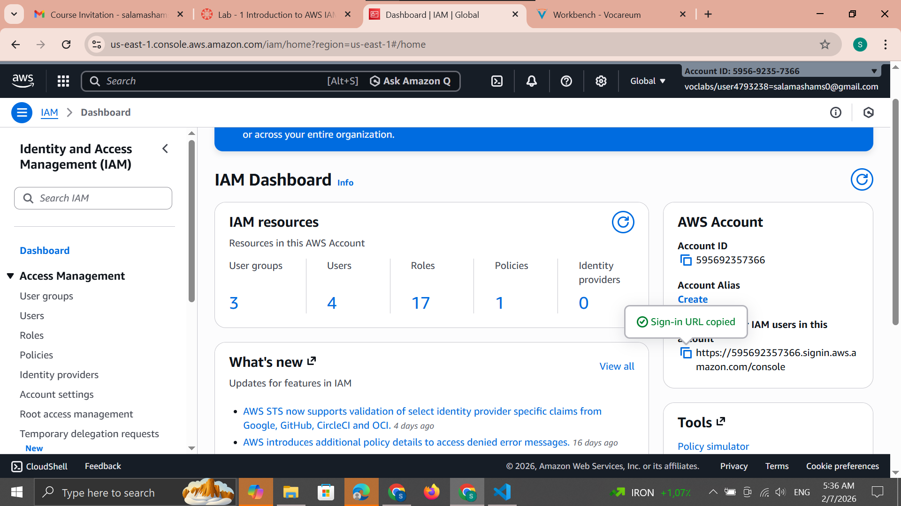

2. Open a private (Incognito) window  
3. Sign in with:
   - **Username:** user-1  
   - **Password:** Lab-Password1  

❌ Access denied:

4. Search for **S3**

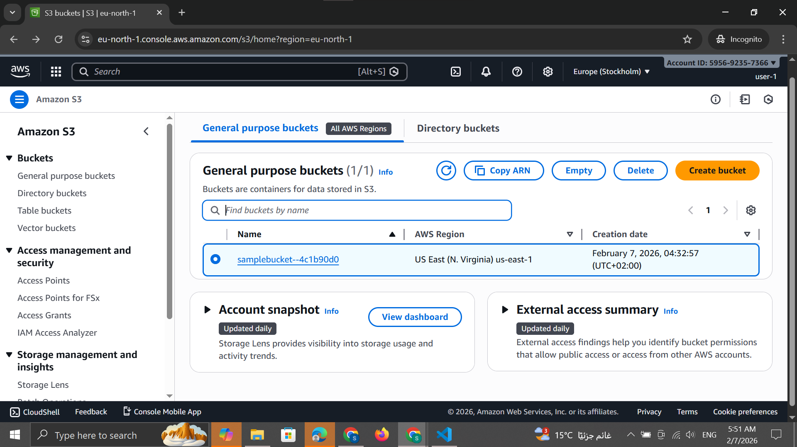

5. Search for **EC2**

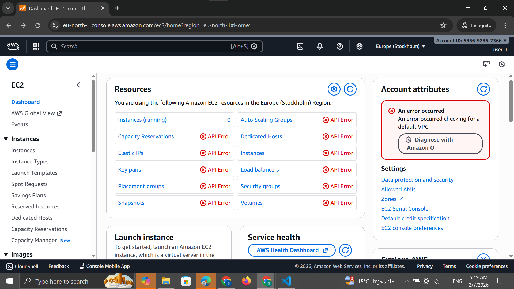

6. Open **Instances**  
   - No instances are visible

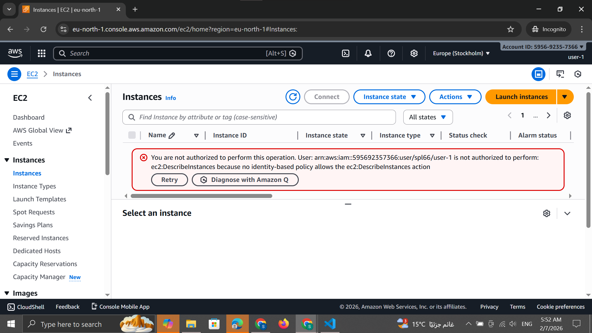

7. Sign out

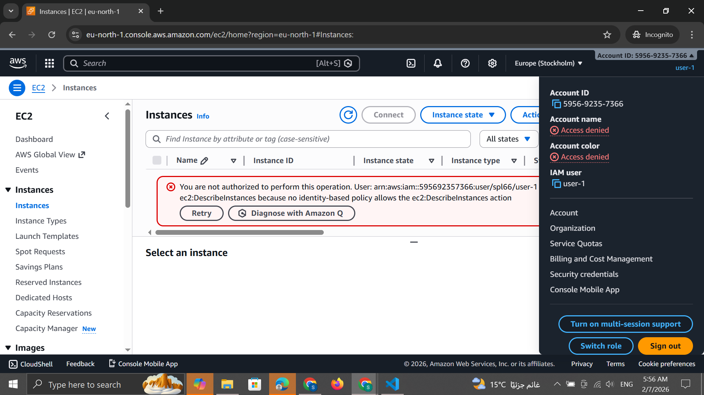

---

### User 2 Test
1. Sign in as:
   - **Username:** user-2  
   - **Password:** Lab-Password2  

2. Open **EC2 → Instances**

> If no instances appear, ensure the correct region is selected.

3. Select the instance **LabHost**  
4. Try to stop the instance

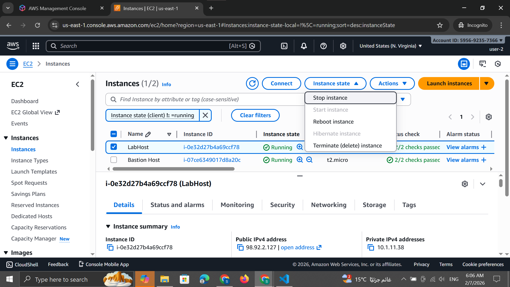

❌ Unauthorized operation (read-only access):

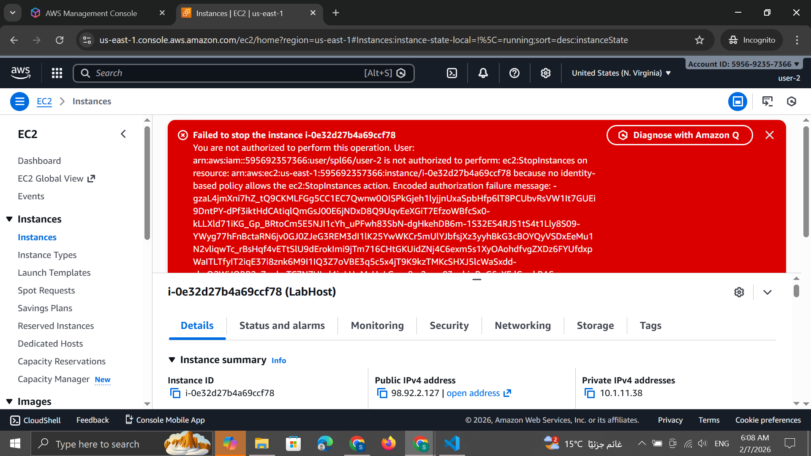

5. Search for **S3**

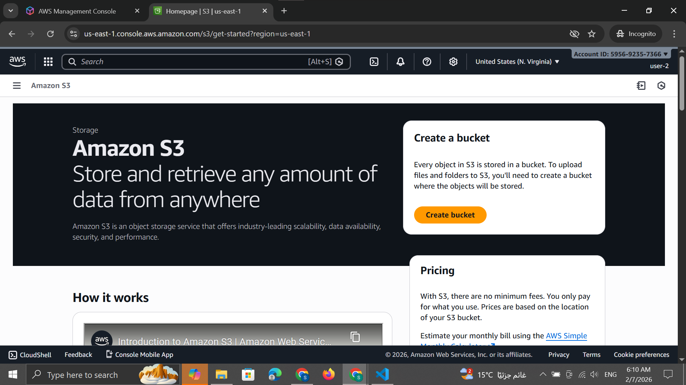

6. Sign out

---

### User 3 Test (EC2 Admin)
1. Sign in as:
   - **Username:** user-3  
   - **Password:** Lab-Password3  

2. Open **EC2 → Instances**

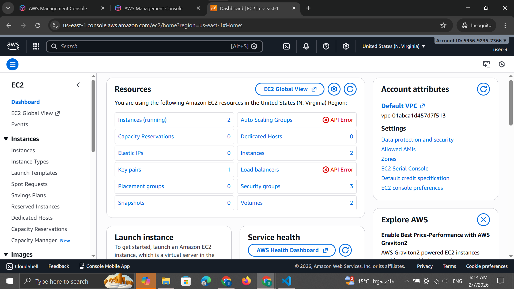

3. Select **LabHost**
4. Stop the instance successfully

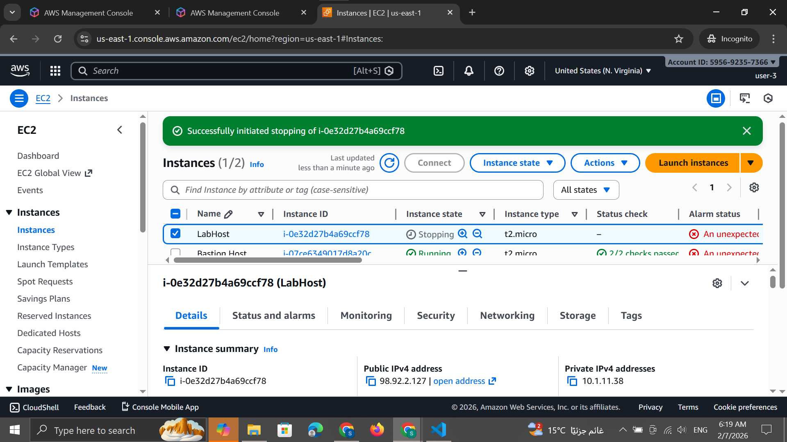

✅ Instance stopped successfully due to full permissions:

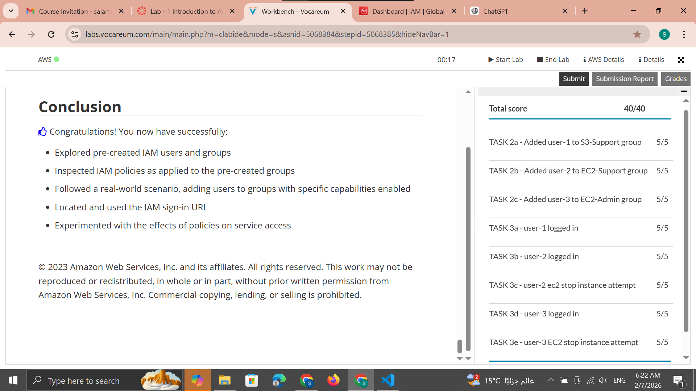
