# Lab 4: Working with EBS

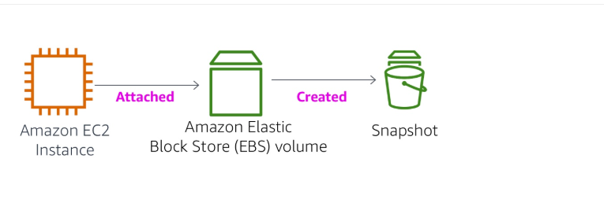

**Topics covered**  
- Create an Amazon EBS volume  
- Attach and mount your volume to an EC2 instance  
- Create a snapshot of your volume  
- Create a new volume from your snapshot  
- Attach and mount the new volume to your EC2 instance  

**Amazon EBS Volume Features**  
- Persistent storage: Volume lifetime is independent of any particular Amazon EC2 instance.  
- General purpose: Amazon EBS volumes are raw, unformatted block devices that can be used from any operating system.  
- High performance: Amazon EBS volumes are equal to or better than local Amazon EC2 drives.  
- High reliability: Amazon EBS volumes have built-in redundancy within an Availability Zone.  
- Designed for resiliency: The AFR (Annual Failure Rate) of Amazon EBS is between 0.1% and 1%.  
- Variable size: Volume sizes range from 1 GB to 16 TB.  
- Easy to use: Amazon EBS volumes can be easily created, attached, backed up, restored, and deleted.

**Task 1: Create a New EBS Volume**  
1. In the AWS Management Console, in the search box next to Services, search for and select EC2.  
2. In the left navigation pane, choose Instances.  
   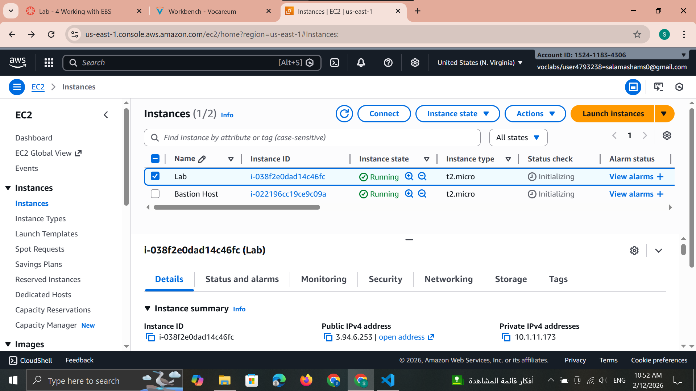  
3. In the left navigation pane, choose Volumes.  
   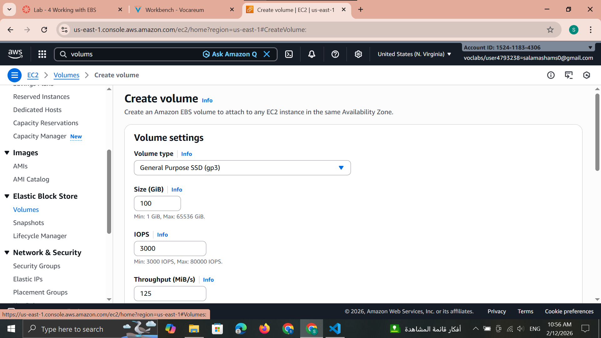  
4. Choose Create volume then configure:  
   - Volume Type: General Purpose SSD (gp2)  
   - Size (GiB): 1. NOTE: You may be restricted from creating large volumes.  
   - Availability Zone: Select the same availability zone as your EC2 instance.  
   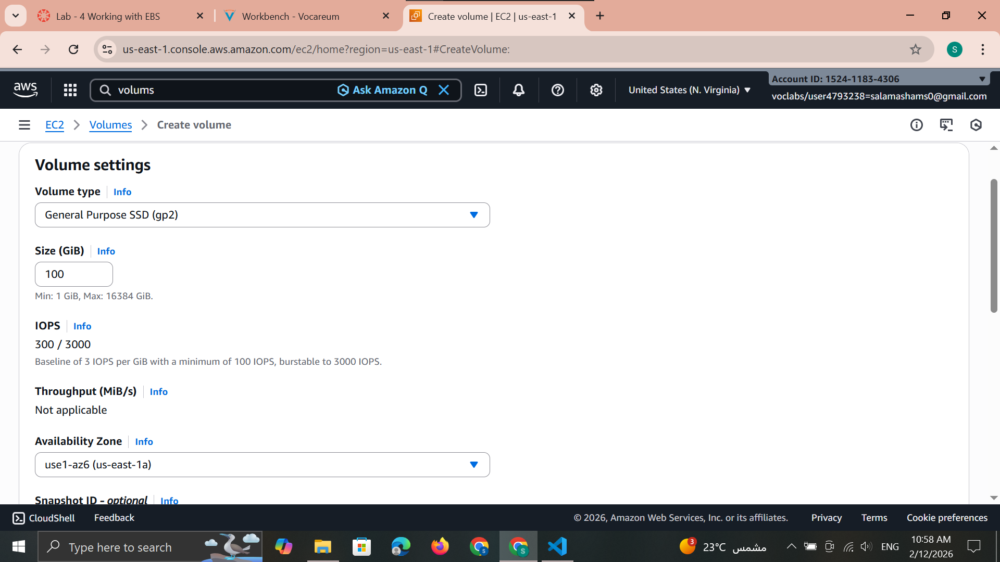  
   - Choose Add tag  
   - In the Tag Editor, enter  
     - Key: Name  
     - Value: My Volume  
   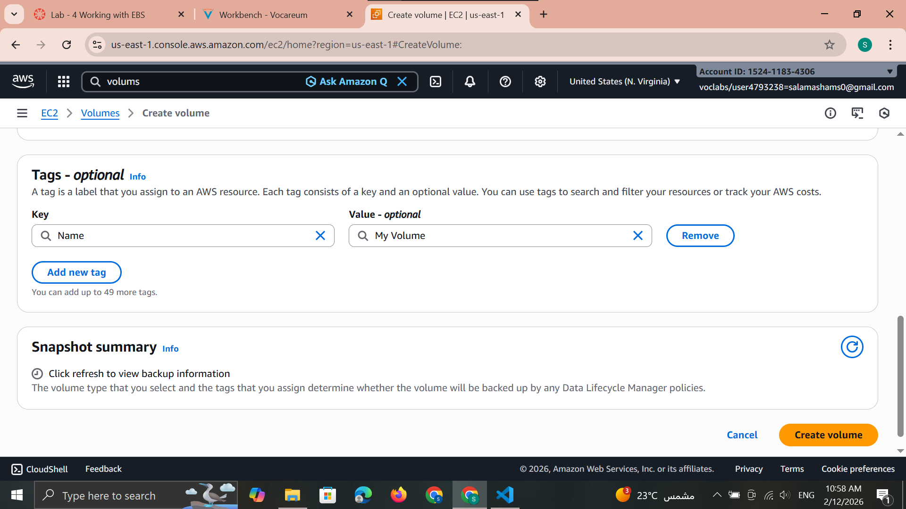  
5. Choose Create Volume  
   Your new volume will appear in the list, and will move from the Creating state to the Available state. You may need to choose refresh to see your new volume.  
   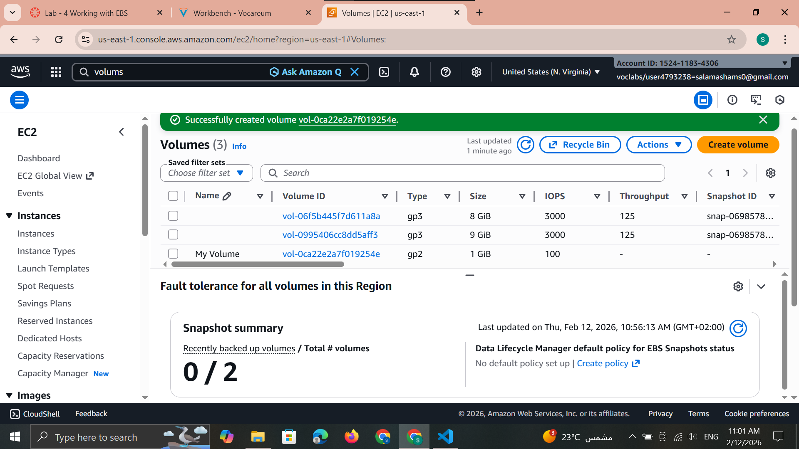

**Task 2: Attach the Volume to an Instance**  
1. Select My Volume  
2. In the Actions menu, choose Attach volume.  
   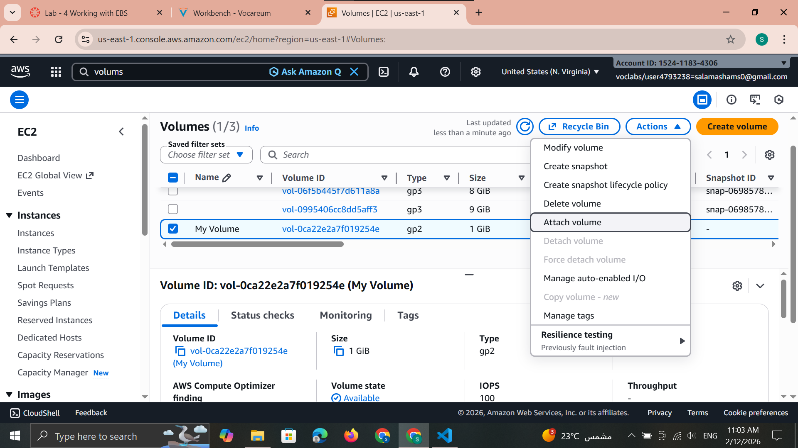  
3. Choose the Instance field, then select the Lab instance  
   Note that the Device name is set to /dev/sdf. Notice also the message displayed that "Newer Linux kernels may rename your devices to /dev/xvdf through /dev/xvdp internally, even when the device name entered here (and shown in the details) is /dev/sdf through /dev/sdp."  
4. Choose Attach volume  
   The volume state is now In-use.  
   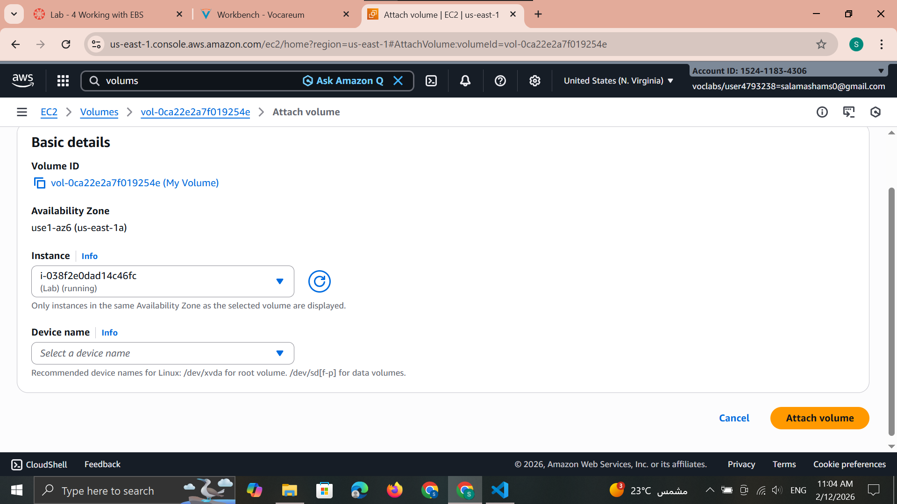  
   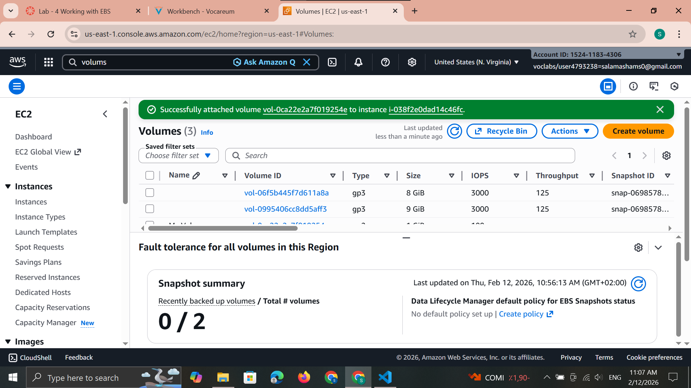

**Task 3: Connect to Your Amazon EC2 Instance**  
1. In the AWS Management Console, in the search box next to Services, search for and select EC2.  
2. Choose Instances  
3. Select the Lab instance, and then choose Connect.  
   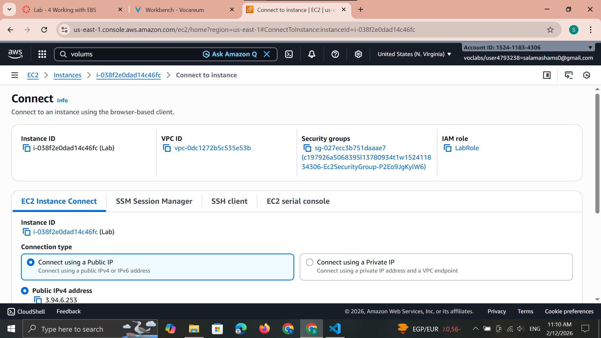  
4. On the EC2 Instance Connect tab, choose Connect.  
   An EC2 Instance Connect terminal session opens and displays a $ prompt.  
   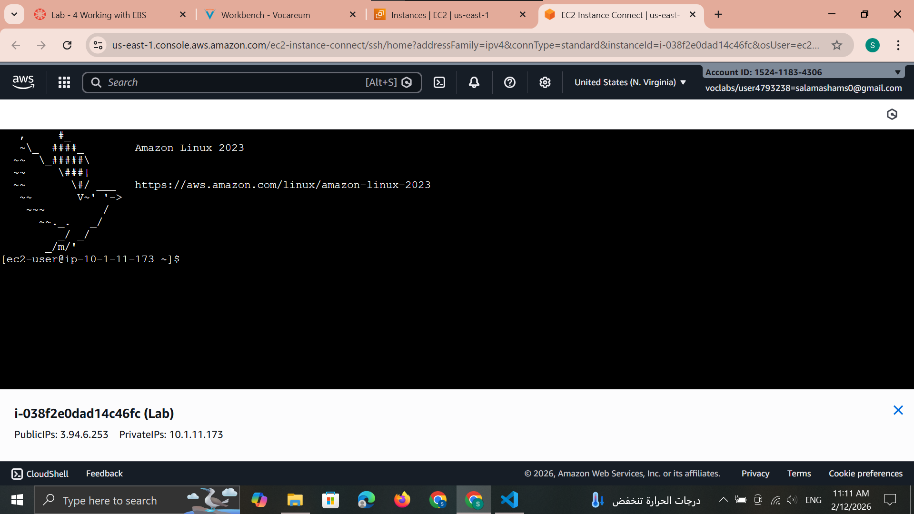

**Task 4: Create and Configure Your File System**  
"In this task, you will add the new volume to a Linux instance as an ext3 file system under the /mnt/data-store mount point."  

1. View the storage available on your instance:  
   Run the following command:  
   "df -h"  
   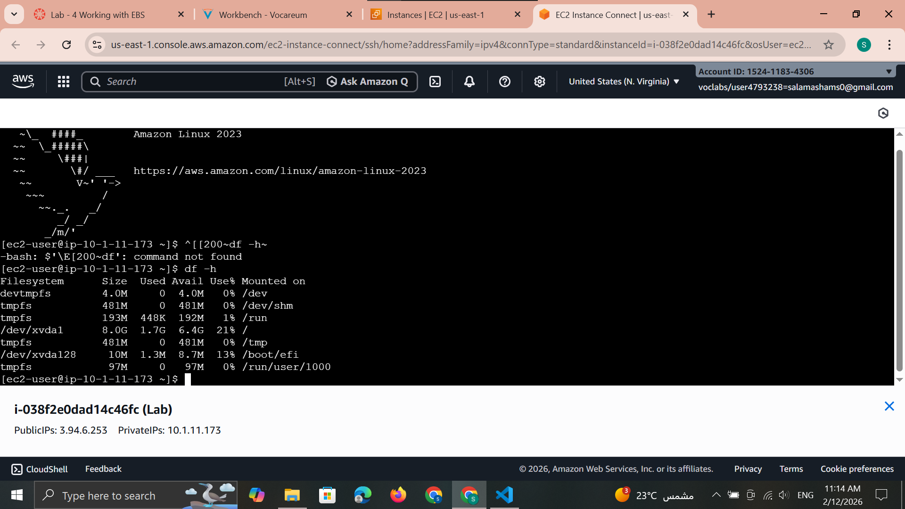  

2. Create an ext3 file system on the new volume:  
   "sudo mkfs -t ext3 /dev/sdf"  
     
   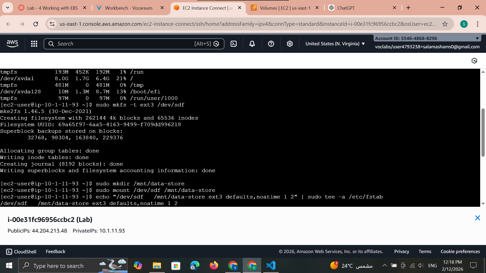  

3. Create a directory for mounting the new storage volume:  
   "sudo mkdir /mnt/data-store"  

4. Mount the new volume:  
   "sudo mount /dev/sdf /mnt/data-store"  

5. To configure the Linux instance to mount this volume whenever the instance is started, add a line to /etc/fstab:  
   "echo "/dev/sdf   /mnt/data-store ext3 defaults,noatime 1 2" | sudo tee -a /etc/fstab"  

6. View the configuration file to see the setting on the last line:  
   "cat /etc/fstab"  

7. View the available storage again:  
   "df -h"  
   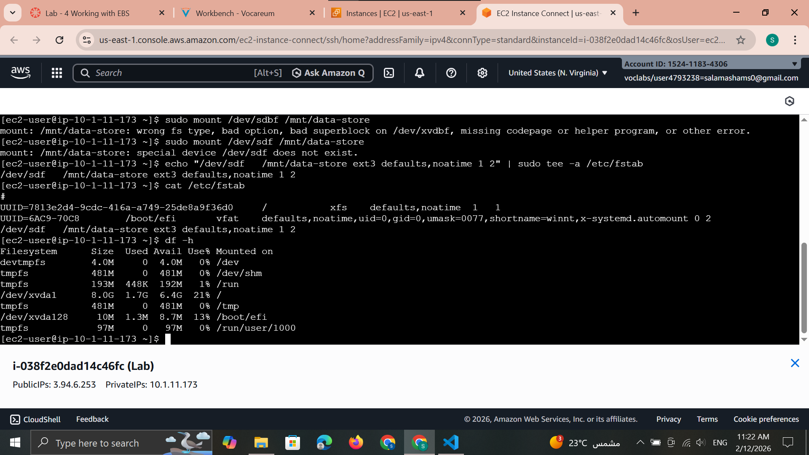  

8. On your mounted volume, create a file and add some text to it:  
   "sudo sh -c \"echo some text has been written > /mnt/data-store/file.txt\""  

9. Verify that the text has been written to your volume:  
   "cat /mnt/data-store/file.txt"

**Task 5: Create an Amazon EBS Snapshot**  
You can create any number of point-in-time, consistent snapshots from Amazon EBS volumes at any time. Amazon EBS snapshots are stored in Amazon S3 with high durability. New Amazon EBS volumes can be created out of snapshots for cloning or restoring backups. Amazon EBS snapshots can also be easily shared among AWS users or copied over AWS regions.  

1. In the EC2 Console, choose Volumes and select My Volume.  
2. In the Actions menu, select Create snapshot.  
   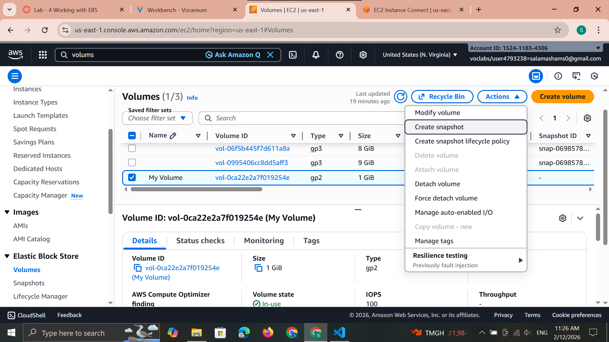  
3. Choose Add tag then configure:  
   - Key: Name  
   - Value: My Snapshot  
   - Choose Create snapshot  
   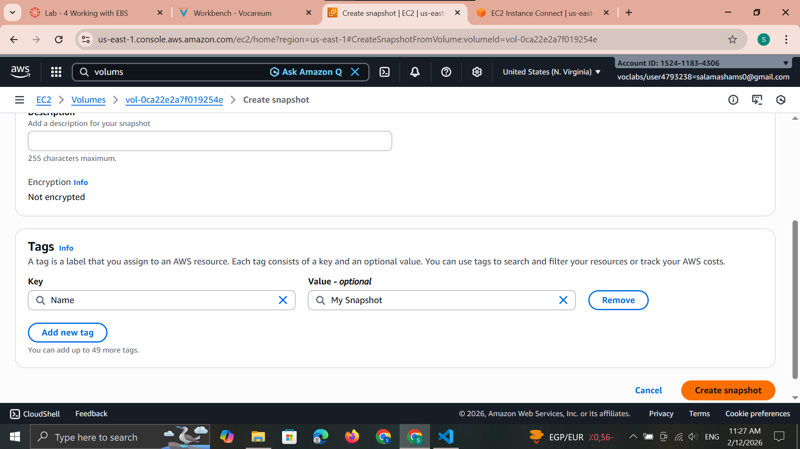  
   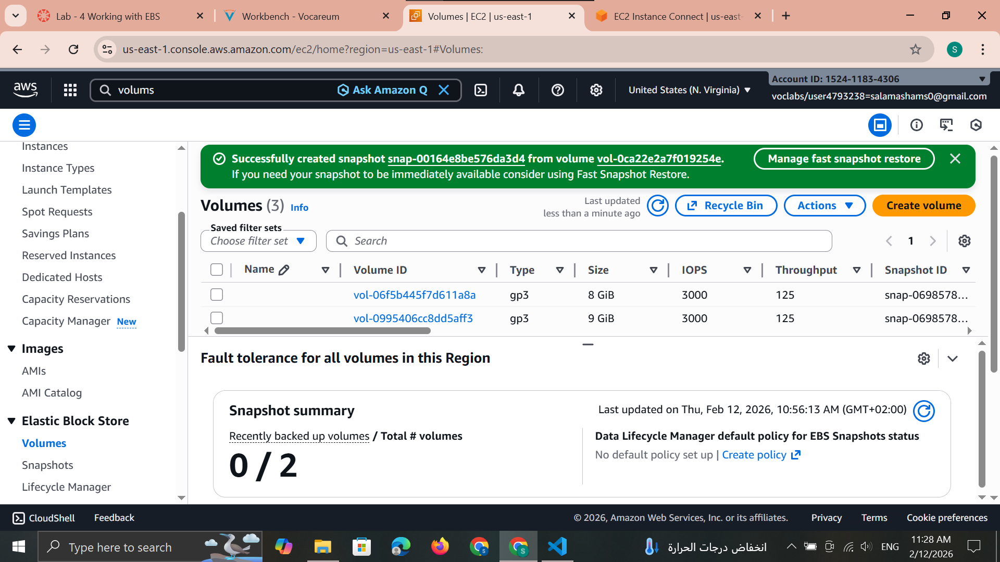  
4. In the left navigation pane, choose Snapshots.  
5. In your EC2 Instance Connect session, delete the file that you created on your volume:  
   "sudo rm /mnt/data-store/file.txt"  
6. Verify that the file has been deleted:  
   "ls /mnt/data-store/"  
7. Your file has been deleted.

**Task 6: Restore the Amazon EBS Snapshot**  
1. Create a Volume Using Your Snapshot  
   - In the EC2 console, select My Snapshot  
   - In the Actions menu, select Create volume from snapshot  
   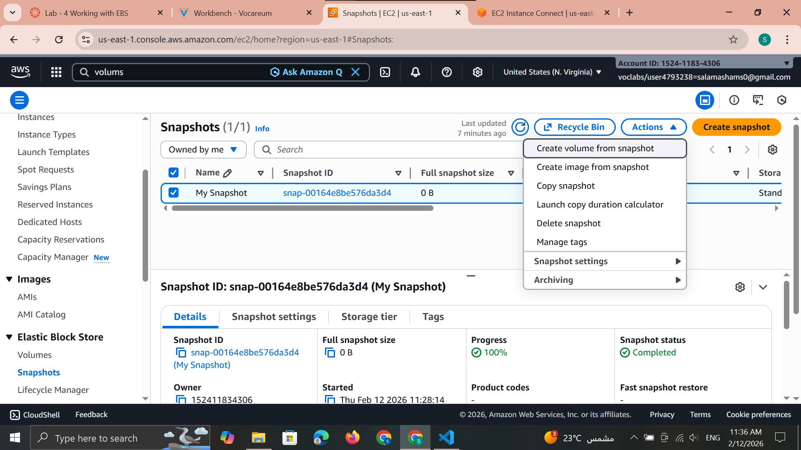  
   - For Availability Zone, select the same availability zone that you used earlier.  
   - Choose Add tag then configure:  
     - Key: Name  
     - Value: Restored Volume  
   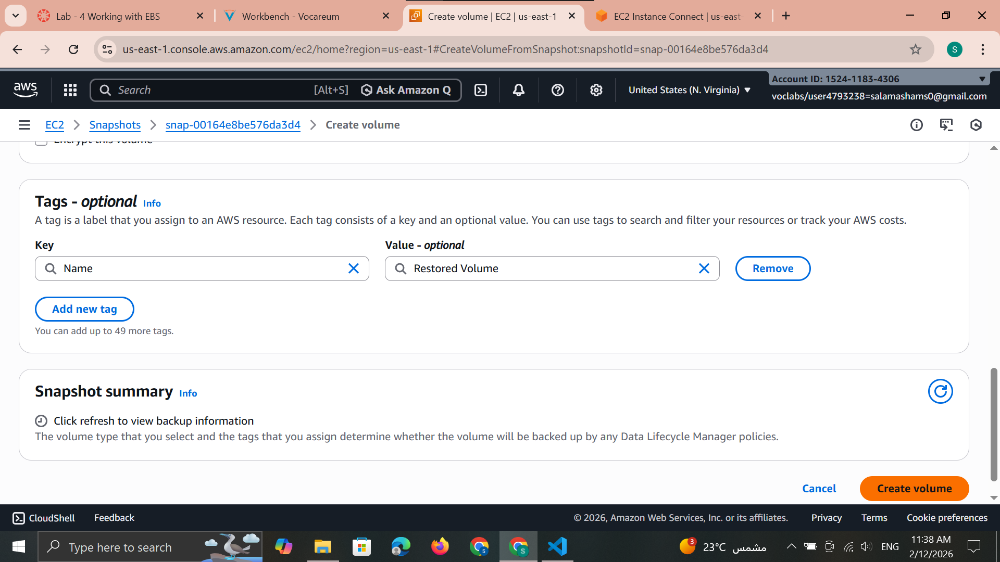  
     - Choose Create volume  
   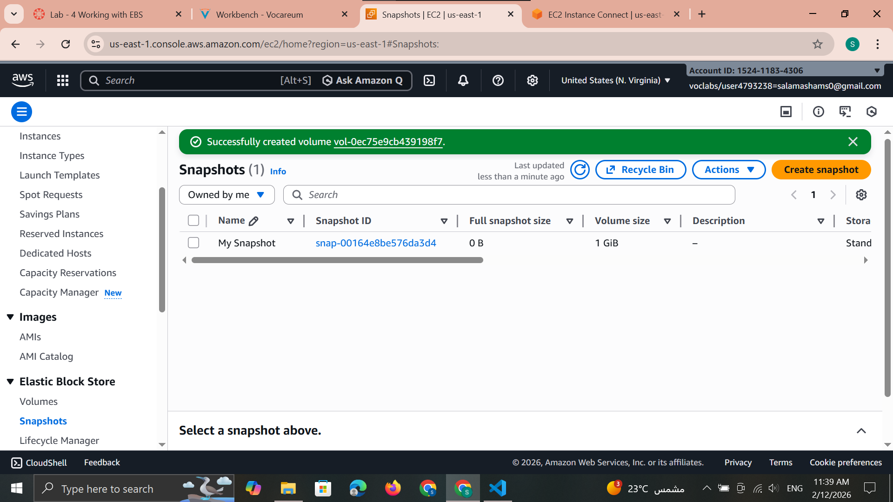  
   Note: When restoring a snapshot to a new volume, you can also modify the configuration, such as changing the volume type, size or Availability Zone.  

2. Attach the Restored Volume to Your EC2 Instance  
   - In the left navigation pane, choose Volumes.  
   - Select Restored Volume.  
   - In the Actions menu, select Attach volume.  
   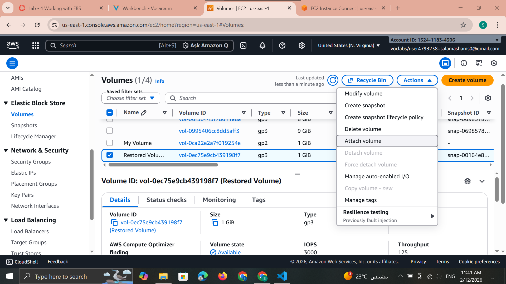  
   - Choose the Instance field, then select the Lab instance that appears.  
   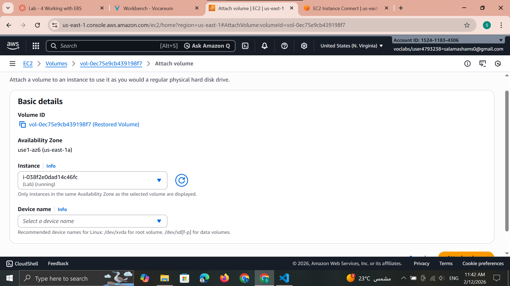  
   Note that the Device field is set to /dev/sdg. You will use this device identifier in a later task.  
   - Choose Attach volume  
     The volume state is now in-use.  
   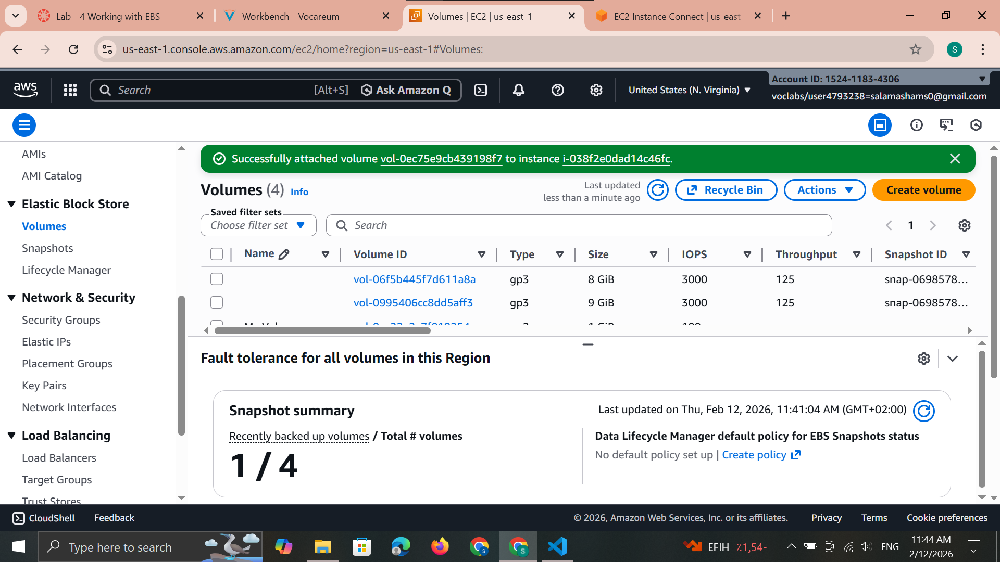  

3. Mount the Restored Volume  
   - Create a directory for mounting the new storage volume:  
     "sudo mkdir /mnt/data-store2"  
   - Mount the new volume:  
     "sudo mount /dev/sdg /mnt/data-store2"  
   - Verify that volume you mounted has the file that you created earlier:  
     "ls /mnt/data-store2/"  
     You should see file.txt.  
     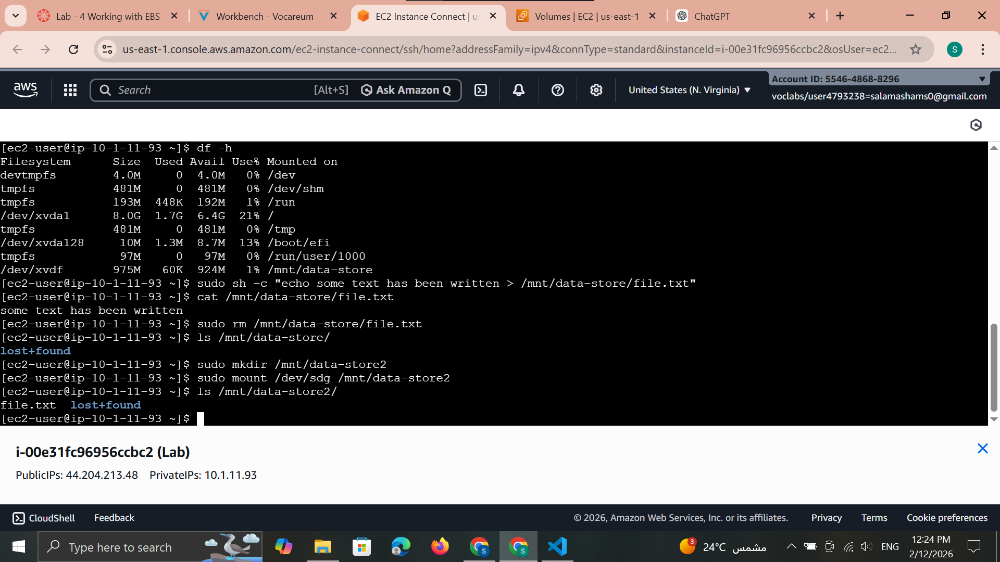

**Final Work**  
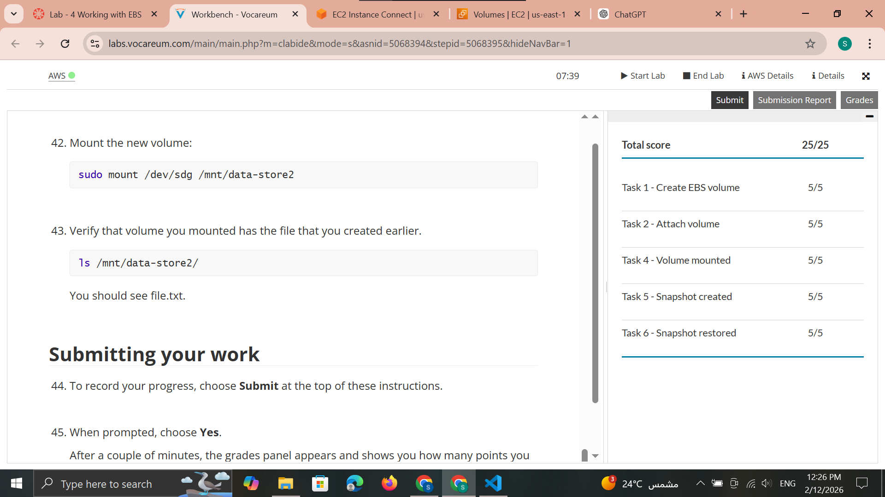